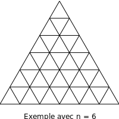

# Compter le nombre de triangles dans une figure

Auteur : Franck CHAMBON

## Problème original

{ align=left }

Un triangle est construit avec des petits triangles.  
Tous les triangles sont équilatéraux et identiques.  
Il y en a $n$ sur chaque côté.

[Combien y a-t-il de triangles sur cette figure ?](#){ .md-button }

On compte tous les triangles équilatéraux dessinés.

??? tip "Indices"
    === "Pour $n=1$"
        Il y en a $1$.

    === "Pour $n=2$"
        Réponse: $5$. Il y a $3$ petits et un grand tête en haut, un autre tête en bas.

    === "Pour $n=3$"
        Il y en a $10+3$.

    === "Cas général"
        À vous de trouver !

Ce problème sera résolu de manière progressive, et c'est l'occasion d'utiliser :

- des méthodes par force brute ;
- des méthodes par récurrence ;
- des méthodes avec les coefficients binomiaux.


## Problème simplifié

{ align=left }

Avec une grille rectangulaire à côtés entiers : $n$ par $m$.

On compte le nombre de rectangles dessinés, que l'on note $R_{n, m}$.

[Combien y a-t-il de rectangles sur cette figure ?](#){ .md-button }

On compte tous les rectangles dessinés.  


??? tip "Indices"
    === "Pour $n=1$ et $m=1$"
        Il y en a $1$.

    === "Pour $n=2$ et $m=2$"
        Réponse $9$.

    === "Pour $n=6$ et $m=10$"
        Réponse $1155$.

    === "Cas général"
        À vous de trouver !

### Résolution par force brute

```python
--8<--- "docs/1.Compte_triangles/triangles/R_brute.py"
```

```
>>> R_brute(6, 10)
1155
```


Pour un rectangle, on considère $A$ le coin supérieur gauche, et $B$ l'inférieur droit.

On prend tous les indices de ligne et de colonne possibles pour $A$ et $B$, et le rectangle est valide si $A_i < B_i$ et $A_j < B_j$.


### Quelques propriétés

On a aisément :

- $\forall n, m \in \mathbb N : R_{n, m} = R_{m, n}$ ;
- $\forall n \in \mathbb N : R_{n, 0} = 0$ ;
- $\forall n \in \mathbb N : R_{n, 1} = \sum_{i=0}^{n} i =\binom{n+1}2$.

On a aussi, avec une récurrence sur $m$, et un peu de travail :

- $\forall n, m \in \mathbb N^* : R_{n, m} = R_{n, m-1} + \sum_{i=0}^{n}m\times i$
- $\forall n, m \in \mathbb N^* : R_{n, m} = R_{n, m-1} + m\binom{n+1}2$
- $\forall n, m \in \mathbb N^* : R_{n, m} = \binom{n+1}2 \binom{m+1}2$


!!! warning "Attention"
    Un exercice est inclus dans le script ci-dessous.


On peut alors vérifier :

<iframe src="https://console.basthon.fr/?from={{ io_url }}{{ page.url }}/R_semi_brute.py" width="2500" height="800"></iframe>


Quand ce programme s'exécute sans message d'erreur, les tests sont validés.

### Bilan

Nous aurions aussi pu dès le départ établir une formule pour $R_{n, m}$ en affirmant que le nombre de rectangles est :

- le nombre de façons de choisir un rectangle ;
- et donc le nombre de façons de choisir
    - deux abscisses distinctes parmi $m+1$,
    - et deux ordonnées distinctes parmi $n+1$.
- D'où le $R_{n, m} = \binom{n+1}2 \binom{m+1}2$.

## Retour au Problème original

### Construction des points

#### Avec un ensemble

En utilisant un repère dans un réseau triangulaire, on peut définir l'ensemble des points inclus dans un triangle de côté $n$.

```python
def ens_triangle(n):
    """Renvoie l'ensemble des points
       - à coordonnées entières ;
       - inclus dans le triangle de côté n.
    """
    points = {}
    for i in range(n+1):
        for j in range(n+1):
            if i + j <= n:
                points.add( (i, j) )
    return points
```

On a ici construit un ensemble (*set*) Python, on aurait pu aussi construire la liste de la même manière ; en effet, il n'y a pas de doublons créés.


#### Avec une liste

```python
def lst_triangle(n):
    """Renvoie la liste des points distincts
       - à coordonnées entières ;
       - inclus dans le triangle de côté n.
    """
    points = []
    for i in range(n+1):
        for j in range(n+1):
            if i + j <= n:
                points.append( (i, j) )
    return points
```

En dehors de la *docstring*, les différences sont :

- `points` est initialisé à `[]` la liste vide, au lieu de `{}` l'ensemble vide.
- `points` croît avec `append` qui ajoute en fin de liste, au lieu de `add` qui ajoute à l'ensemble (en vérifiant qu'il n'y ait pas de doublon).


#### Avec une liste en compréhension

> Cette technique est au programme en spécialité Mathématiques en classe de première. **Cependant**, nous le faisons ici avec une double boucle, ce qui n'est pas au programme...

```python
def lst_triangle(n):
    """Renvoie la liste des points distincts
       - à coordonnées entières ;
       - inclus dans le triangle de côté n.
    """
    return [(i, j) for i in range(n+1) for j in range(n+1) if i + j <= n]
```


#### Avec un itérateur (pour aller plus loin)

On peut aussi construire un **itérateur** au lieu d'une liste : c'est un objet qui fabrique les éléments de la liste, l'un après l'autre, sans stocker la liste entière. Les itérateurs sont très utiles lorsque l'on veut pouvoir traiter un élément entièrement puis l'oublier avant de passer au suivant.
> On ne crée pas la liste qui prendrait inutilement de la place en mémoire.

```python
def it_triangle(n):
    """Renvoie un itérateur des points distincts
       - à coordonnées entières ;
       - inclus dans le triangle de côté n.
    """
    for i in range(n+1):
        for j in range(n+1):
            if i + j <= n:
                yield (i, j)
```


### Utilisation

On souhaite compter le nombre de triangles à côtés entiers dont les sommets et côtés sont dans un réseau triangulaire le tout enceint dans un grand triangle de côté $n$.

Il suffit de faire une triple boucle sur la liste de points du réseau ; on obtient $A$, $B$, $C$, dont il suffit de vérifier qu'ils constituent bien un triangle respectant les contraintes, et que le triangle formé est unique.

Dans notre problème, il y a deux sortes de triangles à compter, ceux pointe en bas, et ceux pointe en haut.

- Pour les triangles pointe en haut, on note $A$ le sommet en bas à gauche, $B$ le sommet en bas à droite, et $C$ le sommet en haut. On a :
    - $A_j = B_j$ ; même ordonnée pour $A$ et $B$.
    - $A_i = C_i$ ; même abscisse pour $A$ et $C$.
    - $B_i - A_i = C_j - A_j \neq 0$ ; le côté du triangle.

- Pour les triangles pointe en bas, on note $A$ le sommet en haut à gauche, $B$ le sommet en haut à droite, et $C$ le sommet en bas. On a :
    - $A_j = B_j$ ; même ordonnée pour $A$ et $B$.
    - $A_i = C_i$ ; même abscisse pour $A$ et $C$.
    - $A_i - B_i = A_j - C_j \neq 0$ ; le côté du triangle.

On constate que ces conditions sont *in fine* les mêmes, ce qui nous conduit au test :

```python
def est_triangle(A_i, A_j, B_i, B_j, C_i, C_j):
    """Renvoie un booléen,
    - True, si ABC est un triangle sur le réseau ;
    - False, sinon.
    """
    return (A_j == B_j) and (A_i == C_i) and (B_i - A_i == C_j - A_j != 0)
```

### Algorithme force brute

```python
def force_brute(n):
    ans = 0
    points = lst_triangle(n)
    for (A_i, A_j) in points:
        for (B_i, B_j) in points:
            for (C_i, C_j) in points:
                if est_triangle(A_i, A_j, B_i, B_j, C_i, C_j):
                    ans += 1
    return ans
```

### Premières valeurs

```python
print([force_brute(n) for n in range(10)])
```

Résultat :

``` python
[0, 1, 5, 13, 27, 48, 78, 118, 170, 235]
```


On peut parfois calculer par `force_brute` les premiers résultats d'un problème.

- Cela permet de comparer avec une nouvelle version d'un programme, plus efficace, plus complexe, mais possiblement avec quelques erreurs. C'est une bonne pratique !
- Cela permet de vérifier s'il existe des résultats similaires sur OEIS ; une encyclopédie qui peut donner de nouvelles pistes de travail. Testons !

### Informations trouvées sur [OEIS](https://oeis.org)

La [recherche](https://oeis.org/search?q=0,+1,+5,+13,+27,+48,+78,+118,+170,+235&language=french&go=Search) avec les premiers termes donne :

>
>Chercher: **seq:0,1,5,13,27,48,78,118,170,235**  
>Displaying 1-1 of 1 result found.  
>[A002717](https://oeis.org/A002717) a(n) = floor(n(n+2)(2n+1)/8).

Puis des détails sur la seule suite concordante, d'indice d'entrée A002717.

### Une nouvelle formule

On note $a_n$ la réponse à notre problème pour un grand triangle de taille $n$. Chaque côté possède $n+1$ points du réseau.

- $a_0 = 0$ ; avec un point, pas de triangle.
- $a_1 = 1$ ; trois points nous donnent un seul triangle.

Une relation de récurrence naturellement proposée est $a_n = a_{n-1} + \Delta_n + \nabla_n$, où

- $\Delta_n$ est le nombre de nouveaux triangles tête en haut ; la base est tout en bas.
- $\nabla_n$ est le nombre de nouveaux triangles tête en bas ; le sommet est tout en bas.

Il est très facile de trouver une formule pour $\Delta_n$, un peu plus délicat pour $\nabla_n$.

- $\Delta_n = \binom{n+1}2$ ; choisir les deux sommets de la base parmi les $n+1$.

- $\nabla_n$ peut s'exprimer en fonction de la parité de $n$ :
    - si $n$ est impair, $\nabla_n = 2\times\left(0+1+2+3+\cdots+\dfrac{n-1}2\right)$ ;
    - si $n$ est pair, $\nabla_n = 2\times\left(0+1+2+3+\cdots+\dfrac{n-2}2\right) + \dfrac{n}2$ ;

On peut certes obtenir deux formules polynomiales (deux proches, suivant la parité de $n$) pour exprimer $a_n$, il faut cependant penser à utiliser une autre base que la base canonique des polynômes ; celle des coefficients binomiaux se prête naturellement bien à la sommation ! On a, **après calculs** :

> $a_n = \dfrac{12\binom{n+2}3 - 2\binom{n+1}2 - \binom{n}1 - 2\cdot\chi_\text{impair}(n)}{8}$

On peut la réécrire aussi en termes de [*rising factorials*](https://en.wikipedia.org/wiki/Falling_and_rising_factorials),

> $a_n = \dfrac{2n^{\overline3} - n^{\overline2} - n^{\overline1} - 2\cdot\chi_\text{impair}(n)}{8}$

!!! warning "Attention"
    Bien saisir la définition des *rising factorials*, avec par exemple :

$$n^{\overline3} = n(n+1)(n+2)$$

Une telle formule se prête bien aussi à une méthode d'évaluation proche de celle [Ruffini-Horner](https://fr.wikipedia.org/wiki/M%C3%A9thode_de_Ruffini-Horner).


!!! warning "Attention"
    Un exercice est inclus dans le script ci-dessous.

<iframe src="https://console.basthon.fr/?from={{ io_url }}{{ page.url }}/R_efficace.py" width="2500" height="800"></iframe>

La formule 2 est très efficace, elle ne fait aucune division.

## Problèmes similaires

### Triangles et hexagone convexe


[Combien y a-t-il de triangles sur cette figure ?](#){ .md-button }

On compte tous les triangles équilatéraux dessinés.

??? tip "Indices"
    === "Pour $n=1$"
        Il y en a $6$.

    === "Cas général"
        À vous de trouver !

Lien pour tester votre réponse : [Counting Triangles II](http://www.spoj.com/problems/TCOUNT2/).

### Triangles et hexagone étoilé


[Combien y a-t-il de triangles sur cette figure ?](#){ .md-button }

On compte tous les triangles équilatéraux dessinés.

??? "tip" Indices
    === "Pour $n=1$"
        Il y en a $12+6+2$.

    === "Cas général"
        À vous de trouver !

Lien pour tester votre réponse : [Counting Triangles III](http://www.spoj.com/problems/TCOUNT3/).
