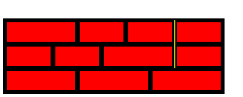
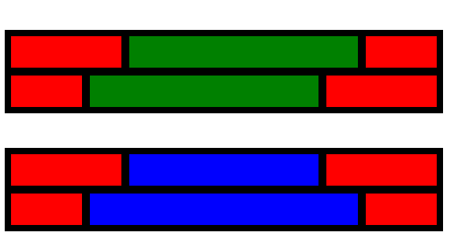

# Dénombrement et graphes

Auteur : Franck CHAMBON

## Contexte

!!! tip "Chemins d'un graphe"
    De nombreux problèmes peuvent être résolus en comptant le nombre de chemins dans un graphe.
    Un graphe possède une matrice de transition, et il suffit d'élever cette matrice à la puissance $k-1$ pour connaître le nombre de chemins de longueur $k$ d'un sommet à un autre.

### Exemple simple de problème résolu avec un graphe

!!! note "Nombre élégant"
    Un nombre est dit *élégant* quand l'écart entre deux chiffres consécutifs est d’au plus $1$. 
    
    Par exemple, $123323454$ est *élégant*, et $12354$ ne l’est pas.

!!! faq "Combien y a-t-il de nombres *élégants* de $8$ chiffres ?"
    
    - On se limitera ici aux nombres dont les chiffres sont de $0$ à $4$.
    - On acceptera les `0` de tête.


On utilise le graphe dont les sommets sont les chiffres de $0$ à $4$, et dont les arêtes sont dessinées ci-dessous :


Un nombre *élégant* de notre problème correspond à un chemin de longueur $7$ dans ce graphe, dont la matrice de transition est :

$$M = 
\begin{pmatrix}
1 & 1 & 0 & 0 & 0 \\
1 & 1 & 1 & 0 & 0 \\
0 & 1 & 1 & 1 & 0 \\
0 & 0 & 1 & 1 & 1 \\
0 & 0 & 0 & 1 & 1 \\
\end{pmatrix}
$$

$M^7$ indique le nombre de chemins de longueur $7$ entre tout couple de sommets.

$$M^7 = 
\begin{pmatrix}
127 & 196 & 189 & 132 &  63 \\
196 & 316 & 328 & 252 & 132 \\
189 & 328 & 379 & 328 & 189 \\
132 & 252 & 328 & 316 & 196 \\
 63 & 132 & 189 & 196 & 127 \\
\end{pmatrix}
$$

La somme des coefficients nous donne le nombre total de chemins de longueur $7$.


!!! tip "Astuce"
    Avec une calculatrice lycée (comme la NumWorks), il suffit d'entrer :

$$
\begin{pmatrix}
1 & 1 & 1 & 1 & 1 \\
\end{pmatrix}
\times
\begin{pmatrix}
1 & 1 & 0 & 0 & 0 \\
1 & 1 & 1 & 0 & 0 \\
0 & 1 & 1 & 1 & 0 \\
0 & 0 & 1 & 1 & 1 \\
0 & 0 & 0 & 1 & 1 \\
\end{pmatrix}^7
\times
\begin{pmatrix}
1 \\
1 \\
1 \\
1 \\
1 \\
\end{pmatrix}
$$

??? done "Réponse"
    Il y a $5275$ nombres élégants à $8$ chiffres (compris entre $0$ et $4$).

!!! example "Remarques"
    1. On aurait pu tout aussi facilement ne pas se restreindre aux chiffres de `0` à `4` ; la matrice aurait eu une taille $10×10$.
    2. Pour exclure les nombres avec zéro de tête, il suffit d'enlever les nombres élégants à $7$ chiffres (eux aussi avec zéros de tête acceptés).

### Problème avec un grand graphe

Pour une matrice de grande taille $n$, il n'est pas raisonnable d'utiliser la multiplication matricielle, le coût est en $\Theta(n^3)$.

On peut aussi travailler avec des [listes d'adjacence](https://fr.wikipedia.org/wiki/Liste_d%27adjacence), dans le cas d'un graphe peu connecté. La matrice est alors creuse (possède de nombreux zéros), et on peut calculer des nombres de **chemins courts** avec de simples itérations, sans utiliser la multiplication matricielle coûteuse...

Prenons, par exemple, le problème suivant issu de [Project Euler](https://projecteuler.net/problem=215 "problème n°215").

!!! tip "Project Euler 215"
    On souhaite construire un mur avec des briques de taille $2×1$ et $3×1$ posées horizontalement tel que, pour plus de solidité, les jointures verticales entre briques ne se suivent pas sur deux rangées successives, *i.e.* ne forment pas de fissure.

    Par exemple, le mur $9×3$ suivant n'est pas valide ; en cause, la fissure marquée en jaune :

    

    Il y a huit façons de construire un mur 9×3 sans fissure, que l'on note $W(9, 3) = 8$.
    
    **Problème :** Déterminer $W(32, 10)$.

!!! exemple "Au programme"

- Modéliser ce problème avec un graphe ;
- le résoudre avec une première méthode ;
- proposer plusieurs améliorations ;
- proposer du code en Python.


## Traduction en problème de graphe

Une rangée de briques est ici modélisée par une suite de nombres parmi $2$ et $3$ dont la somme est égale à la largeur du mur.

Dans le mur précédent, les rangées sont notées :

- $[3, 2, 2, 2]$ ;
- $[2, 2, 3, 2]$ ;
- $[3, 3, 3]$ ;
- chacune de somme $9$.

On définit le graphe dont :

- les sommets sont toutes les rangées possibles,
- les arêtes joignent deux rangées qui ne forment pas de fissure.

Construire un mur sans fissure de hauteur $h$ revient à effectuer un parcours de longueur $h$ dans ce graphe.

!!! tip "Compter le nombre total de murs sans fissure"
    Cela revient à compter le nombre total de chemins de longueur $h$, dans ce graphe.

### Génération des sommets

L'occasion ici de présenter les itérateurs du langage Python (hors programme NSI). On en construit ici un de manière récursive.

Construire une rangée de largeur $n$ :

- c'est construire une rangée de largeur $n-2$ et y ajouter une brique de largeur $2$ ; ou bien
- c'est construire une rangée de largeur $n-3$ et y ajouter une brique de largeur $3$.

{{ py('gen_rangs1') }}

Sortie :
```
[3, 2, 2, 2]
[2, 3, 2, 2]
[2, 2, 3, 2]
[2, 2, 2, 3]
[3, 3, 3]
```

!!! exemple "Remarques"
    - On constate qu'il existe $5$ rangées possibles de largeur $9$.
    - On ne voit pas directement, avec cette modélisation, si deux rangées provoquent une fissure.

### Génération des arêtes

Deux rangées provoquent-elles une fissure ?

Une solution simple consiste à calculer la suite des sommes partielles (pour deux rangées) et vérifier que seul le total est en commun.

{{ py('gen_aretes1')}}

Sortie :
```
Pour un mur de largeur 9 :
La rangée (3, 2, 2, 2) 	 est reliée aux rangées [(2, 2, 2, 3)]
La rangée (2, 3, 2, 2) 	 est reliée aux rangées [(3, 3, 3)]
La rangée (2, 2, 3, 2) 	 est reliée aux rangées [(3, 3, 3)]
La rangée (2, 2, 2, 3) 	 est reliée aux rangées [(3, 2, 2, 2)]
La rangée (3, 3, 3) 	 est reliée aux rangées [(2, 3, 2, 2), (2, 2, 3, 2)]
```


On constate sur cet exemple que :

- 4 sommets ne possèdent qu'une arrête en partance ;
- 1 sommet possède deux arrêtes en partance.

Le graphe semble ici peu connecté. À étudier quand la largeur du mur croît.

#### Calcul du nombre de sommets

(Ce paragraphe pourra être ignoré en première lecture)

Le nombre $u_n$ de rangées de longueur $n$ est donné par la récurrence :

- $u_0 = 1$; $u_1 = 0$; $u_2 =1$;
- $u_{n} + u_{n+1} = u_{n+3}$, pour $n\in \mathbb N$.

La solution réelle approchée de l'équation $1+x = x^3$ est $\rho\approx 1.32471795724475$, ce qui nous indique que $u_n \approx K \times \rho^n$ pour une certaine constante. Chose que l'on peut vérifier.

{{ py('exp_nb_sommets' )}}

Sortie :
```bash
Il y a 3329 sommets dans le graphe pour un mur de largeur 32.
0.999999999999997 , proche de 1 ?
K ≈ 0.41149558866263575
```


#### Calcul approché du nombre d'arêtes

(Ce paragraphe pourra être ignoré en première lecture)

Nous ferons le calcul exact dans une autre partie quand nous générerons dynamiquement le graphe.


{{ py('exp_nb_aretes') }}

Sortie (après moins d'une minute de calcul) :
```bash
Nombre de rangées : 3329
Nombre moyen de rangées compatibles : 11.150495644337639
```

- On constate, qu'en effet, on a affaire à une matrice de transition assez grande et creuse. Il ne faudra pas songer à la multiplier avec des méthodes classiques.

- On constate que notre approche naïve pour déterminer si deux rangées sont compatibles est très lente (plusieurs secondes ici), il faut songer à l'améliorer.


## Une première modélisation efficace

Pour représenter une rangée, on va utiliser un seul entier et sa représentation binaire. Par exemple notre mur fissuré d'introduction sera représenté par les rangées :

- `100101010` : pour $[3, 2, 2, 2]$ ;
- `101010010` : pour $[2, 2, 3, 2]$ ;
- `100100100` : pour $[3, 3, 3]$ ;

!!! info "Test rapide"
    Le grand bord vertical à droite n'est pas représenté avec cette modélisation. On peut tester avec un simple **et logique bit à bit** si deux rangées sont compatibles ou non ; le résultat devra être `100000000` en binaire pour deux rangées compatibles. De plus, le gain de place est conséquent, ce qui accélère les calculs.

{{ py('gen_rangs2') }}

Sortie :
```bash
0b100101010
0b101001010
0b101010010
0b101010100
0b100100100
```

On retrouve nos 5 rangées, et on constate visuellement très vite (en binaire) qu'il n'y en pas deux successives sans fissure (dans cet ordre là).

### Génération des arêtes

Pour déterminer si deux rangées $r_1$ et $r_2$ (de largeur $n$) sont sans fissure, il suffira de faire un **et logique bit à bit** : `r1 & r2 == 1 << (n-1)`

{{ py('gen_aretes2') }}

Sortie :
```bash
298 reliée à [340]
330 reliée à [292]
338 reliée à [292]
340 reliée à [298]
292 reliée à [330, 338]
```

!!! exemple "Remarques"
    1. Il sera plus commode de renuméroter nos sommets du graphe (les rangées du mur) par des nombres entiers consécutifs à partir de $0$.
    2. On utilise encore un dictionnaire pour cela, un outil très utile !

{{ py('gen_aretes3') }}

Sortie :
```bash
0 reliée à [3]
1 reliée à [4]
2 reliée à [4]
3 reliée à [0]
4 reliée à [1, 2]
```

Cette méthode est un peu lente pour construire le graphe, mais permet ensuite un calcul rapide du nombre de chemins cherché.

### Utilisation de la matrice creuse

Si on cherche le nombre de murs de hauteur $h$, il suffit de calculer la somme des coefficients de la matrice $M^{h-1}$. Nous l'avions vu en exemple introductif.

- On calcule $V' = M^{h-1}\times V$, où $V$ est un vecteur colonne rempli de $1$.
- La solution au problème est la somme des composantes de $V'$.
- Pour calculer $V'$, on procède avec une boucle :
    - **Initialisation** : $V$, un vecteur colonne rempli de $1$.
    - **Répéter $h-1$ fois** : $V \leftarrow M\times V$

{{ py('complet1') }}

Sortie :
```bash
W(9, 3) = 8
```

!!! done "Réussite"
  - On retrouve l'information initiale de l'énoncé : $W(9, 3) = 8$.
  - Nous avons là un programme capable de répondre au problème initial en quelques secondes, mais il n'est pas optimal.


## Meilleure construction de la matrice de transition

Un peu d'introspection nous conduit à voir que :

- La dernière partie est de la classique programmation dynamique ; elle ne peut pas être franchement améliorée. On pourrait juste voir que le graphe possède des symétries.
    - Une symétrie verticale. Chaque mur sans fissure construit possède un symétrique. L'exploitation de cette symétrie est délicate ; il y a 8 façons de découper en deux un mur de hauteur 2, selon où se situe la jointure. On peut gagner un facteur 2 en temps et en espace, mais on ne peut pas utiliser une modélisation plus compacte des rangées et le code est bien plus complexe... Nous ne présentons pas ici le code. Il permet de calculer $W(60, 60)$, **ce qui constitue une première**.
    - Une symétrie horizontale. On partage le mur en deux parties de hauteur égale (ou presque). Il suffit alors de compter le nombre de chemins vers une rangée à la moitié, multiplier par le nombre de chemins venant du sommet jusqu'à cette rangée ; et ce pour toute rangée. On obtient facilement un gain en temps d'un facteur proche de 2 pour la deuxième partie. Nous l'aborderons en dernier.
- En première partie, la construction de la matrice de transition peut se faire en parallèle de la construction des sommets ; c'est encore de la programmation dynamique. Là, on peut gagner beaucoup de temps. Voyons comment faire avec :
    - la modélisation des rangées selon $[3, 2, 2, 2]$
    - la modélisation des rangées selon `100101010`
    - une modélisation plus compacte encore !


### Construction de tous les murs de hauteur 2

Il y a plusieurs façons de choisir un motif générique pour construire par récurrence tous les murs de hauteur 2, cela nous donnera directement tous les sommets connectés et toutes les arêtes de notre graphe.

- Oublions un instant les contraintes aux bords du mur ; elles sont gênantes, ce sont des exceptions. On veut des murs sans fissures, ne travaillons qu'avec de tels murs, sans autre contrainte.
- Si on étudie les briques qui constituent les bords gauche et droite d'un mur de hauteur 2, on observe très vite qu'il s'agit de $[2, 3]$ (verticalement), ou l'inverse, de même à gauche comme à droite.
- On se concentre donc sur ce qui reste :




!!! note "Notation"
    - On notera $A_n$ la liste de tous les murs de largeur moyenne $n$ à forme verte (sans fissure).
    - On notera $B_n$ la liste de tous les murs de largeur moyenne $n$ à forme bleue (sans fissure).


On peut établir une récurrence pour $n\geqslant 3$ :

- $A_n$ s'obtient (en faisant une disjonction des cas sur la brique en haut à droite, largeur 2 ou 3) en concaténant les listes :
    - $A_{n-3}$, où on ajoute à tout élément le couple $(3; 3)$
    - $B_{n-1}$, où on ajoute à tout élément le couple $(2; \varepsilon)$ où $\varepsilon$ représente le mot vide.
    - Cela peut s'écrire $A_n = A_{n-3}\cdot\binom{3}{3} + B_{n-1}\cdot \binom{2}{\varepsilon}$ ; où $+$ est la concaténation de liste et $\cdot$ la concaténation des mots de la liste à gauche par le mot de droite.
- $B_n$ s'obtient (en faisant une disjonction des cas sur la brique en bas à droite, largeur 2 ou 3) en concaténant les listes :
    - $B_{n-3}$, où on ajoute à tout élément le couple $(3; 3)$
    - $A_{n-1}$, où on ajoute à tout élément le couple $(\varepsilon; 2)$ où $\varepsilon$ représente encore le  mot vide.
    - Cela peut s'écrire $B_n = B_{n-3}\cdot\binom{3}{3} + A_{n-1}\cdot \binom{\varepsilon}{2}$ ; avec les mêmes notations que précédemment.

Avec comme conditions initiales :

$$A_0 = \binom{\varepsilon}{\varepsilon} \qquad B_0 = \varnothing$$

$$A_1 = \varnothing \qquad B_1 = \binom{\varepsilon}{2}$$

$$A_2 = \binom{2}{2} \qquad B_2 = \varnothing$$

On peut construire (et dessiner) sans peine :

$$A_3 = \binom{3}{3} \qquad B_3 = \binom{2}{2;2}$$

$$A_4 = \binom{2;2}{2;2} \qquad B_4 = \binom{3}{2;3},\binom{3}{3;2}$$

$$A_5 = \binom{3;2}{2;3},\binom{3;2}{3;2},\binom{2;3}{2;3} \qquad B_5 = \binom{2;2}{2;2;2}$$

Pour obtenir nos transitions pour un mur de hauteur 2 et de largeur $n \geqslant 5$, on aura la formule :

$$T_n = \binom32\cdot B_{n-5}\cdot\binom32 + \binom32\cdot A_{n-5}\cdot\binom23$$


### Calcul exact du nombre d'arêtes

Si on note $a_n$ (resp. $b_n$) le nombre de murs de la forme $A_n$ (resp. $B_n$), alors le nombre de murs de hauteur 2 et de largeur $n+5$ est $2(a_n+b_n)$, et on a de manière directe que la dynamique de $2(a_n+b_n)$ est liée au polynôme $X^3 - (1+X^2)$, avec comme valeurs initiales $[2, 2, 2]$. Pour les murs de largeur 60, cela donne un graphe avec $1\;\!651\;\!208\;\!832$ arêtes ; et à raison d'un stockage de 4 octets par arêtes, un poids de $6,\!\,6~\text{Go}$. On constate qu'il est très difficile de calculer $W(60, 60)$ avec $8~\text{Go}$ de mémoire vive ; il faut être capable de construire le graphe sans utiliser beaucoup plus de mémoire.

### Implémentation sur modèle $[3, 2, 2, 2]$

```python
def AB(n):
    """ Renvoie A et B, des listes de listes de brique 2 ou 3.
    Ah et Bh correspondent à la partie haute.
    Ab et Bb correspondent à la partie basse.
    Ahnm2, correspond à l'indice n-2
    Ahnm1, correspond à l'indice n-1
    Ahn, correspond à l'indice n
    """
    #n = 2
    Ahnm2 = [0] ; Abnm2 = [0]
    Bhnm2 = []   ; Bbnm2 = []
    Ahnm1 = []   ; Abnm1 = []
    Bhnm1 = [0] ; Bbnm1 = [0b10]
    Ahn   = [0b10]; Abn   = [0b10]
    Bhn   = []   ; Bbn   = []
    for _ in range(3, n+1):
        Ah = [(ah<<3)|0b100 for ah in Ahnm2] + [(bh<<2)|0b10 for bh in Bhn]
        Ab = [(ab<<3)|0b100 for ab in Abnm2] + Bbn
        Bh = [(bh<<3)|0b100 for bh in Bhnm2] + Ahn
        Bb = [(bb<<3)|0b100 for bb in Bbnm2] + [(ab<<2)|0b10 for ab in Abn]
        Ahnm2, Ahnm1, Ahn = Ahnm1, Ahn, Ah
        Bhnm2, Bhnm1, Bhn = Bhnm1, Bhn, Bh
        Abnm2, Abnm1, Abn = Abnm1, Abn, Ab
        Bbnm2, Bbnm1, Bbn = Bbnm1, Bbn, Bb
    return Ah, Ab, Bh, Bb

def T(n):
    """Renvoie les transitions pour un mur de hauteur 2 qui commence
    à gauche par une brique de 2 sous une brique de 3"""
    Ah, Ab, Bh, Bb = AB(n-5)
    Th = [(0b100<<(n-3))|(ah<<2)|0b10 for ah in Ah]
    Th.extend((0b100<<(n-3))|(bh<<3)|0b100 for bh in Bh)
    Tb = [(0b10<<(n-2))|(ab<<3)|0b100 for ab in Ab]
    Tb.extend((0b10<<(n-2))|(bb<<2)|0b10 for bb in Bb)
    return Th, Tb

n = 9
Tn = T(n)
print(f"transitions pour n = {n}")
for haut, bas in Tn:
  print(haut)
  print(bas)
  print()
```

Sortie :

```bash
transitions pour n = 9
298
340

292
338

292
330
```

On retrouve bien les 5 sommets (les rangées possibles) et les 6 transitions, chacune étant inversible (haut/bas). Cette méthode est bien plus rapide.

- $0.06$ s (contre $1.24$s) pour générer le graphe avec $n=32$ ;
- $2.40$ s (contre trop longtemps) pour générer le graphe avec $n=40$ ;

### Implémentation sur modèle `100101010`

Faisons mieux avec un stockage sous forme compacte de chaque rangée. Donnons immédiatement les chronos à la même étape :

- $0.02$ s pour générer le graphe avec $n=32$ ;
- $0.41$ s pour générer le graphe avec $n=40$ ;
- $21.6$ s pour générer le graphe avec $n=50$ ;

Il manque l'autre moitié des transitions et la numérotation des sommets du graphe par des entiers consécutifs, ce qui double environ le temps de calcul de la première partie.

```python
def AB(N):
  """ A et B sont des listes de listes de brique 2 ou 3.
  Ah et Bh correspondent à la partie haute.
  Ab et Bb correspondent à la partie basse.
  Ahnm2, correspond à l'indice n-2
  Ahnm1, correspond à l'indice n-1
  Ahn, correspond à l'indice n
  """
  n = 2
  Ahnm2 = [0] ; Abnm2 = [0]
  Bhnm2 = []   ; Bbnm2 = []
  Ahnm1 = []   ; Abnm1 = []
  Bhnm1 = [0] ; Bbnm1 = [0b10]
  Ahn   = [0b10]; Abn   = [0b10]
  Bhn   = []   ; Bbn   = []
  for n in range(3, N+1):
    Ah = [(ah<<3)|0b100 for ah in Ahnm2] + [(bh<<2)|0b10 for bh in Bhn]
    Ab = [(ab<<3)|0b100 for ab in Abnm2] + Bbn
    Bh = [(bh<<3)|0b100 for bh in Bhnm2] + Ahn
    Bb = [(bb<<3)|0b100 for bb in Bbnm2] + [(ab<<2)|0b10 for ab in Abn]
    Ahnm2, Ahnm1, Ahn = Ahnm1, Ahn, Ah
    Bhnm2, Bhnm1, Bhn = Bhnm1, Bhn, Bh
    Abnm2, Abnm1, Abn = Abnm1, Abn, Ab
    Bbnm2, Bbnm1, Bbn = Bbnm1, Bbn, Bb

  return Ah, Ab, Bh, Bb

def T(n):
  """Renvoie les transitions pour un mur de hauteur 2 qui commence
  à gauche par une brique de 2 sous une brique de 3"""
  Ah, Ab, Bh, Bb = AB(n-5)
  Th = [(0b100<<(n-3))|(ah<<2)|0b10 for ah in Ah]
  Th.extend((0b100<<(n-3))|(bh<<3)|0b100 for bh in Bh)
  Tb = [(0b10<<(n-2))|(ab<<3)|0b100 for ab in Ab]
  Tb.extend((0b10<<(n-2))|(bb<<2)|0b10 for bb in Bb)
  return Th, Tb

n = 9
print(f"transitions pour n = {n}")
Th, Tb = map(list, T(n))

for haut, bas in zip(Th, Tb):
  print(bin(haut))
  print(bin(bas))
  print()
```

Sortie :

```bash
transitions pour n = 9
0b100101010
0b101010100

0b100100100
0b101010010

0b100100100
0b101001010
```


### Implémentation sur modèle compact

Nous n'avons plus besoin d'utiliser le **et bit à bit** pour construire les arêtes, donc on peut utiliser une modélisation d'une rangée par un nombre binaire plus compacte encore.

- On modélise dès lors une rangée de largeur fixée par un nombre binaire où
  - un bit à 1 signifie une brique de largeur 3 à placer ;
  - un bit à 0 signifie une brique de largeur 2 à placer.

Par exemple, on peut comparer les 3 modélisations sur les rangées d'un mur de largeur 9.

|Liste        | Binaire   | Compacte |
|-------------|---------- |--------- |
|[3, 2, 2, 2] |`100101010`|`1000`    |
|[2, 3, 2, 2] |`101001010`|`0100`    |
|[2, 2, 3, 2] |`101010010`|`0010`    |
|[2, 2, 2, 3] |`101010100`|`0001`    |
|[3, 3, 3]    |`100100100`|`111`     |

- Cette nouvelle modélisation est certes plus compacte, mais en pratique elle utilisera un mot machine comme la modélisation binaire tant que la largeur est inférieure à 64. Le gain n'est pas là !
- La construction dynamique est bien plus facile et rapide ! Il n'y plus besoin de décalages de bits complexes. Ajouter une brique à droite revient à :
    - décaler les bits de la rangée d'un seul rang, et mettre le bit de poids faible à 1 uniquement s'il s'agit d'une brique de largeur 3.
- Profitons aussi pour utiliser la structure `array` de Python qui est bien plus adaptée à notre modèle : une liste d'entiers mot-machine. (Valable pour $n$ jusqu'au double de la taille d'un mot machine.)
- **Attention**, cette construction ne fabrique pas les sommets isolés, donc $h=1$ devient un cas particulier à gérer !

```python
from array import array
def AB(n):
    """ A et B sont des listes de listes de brique 2 ou 3.
    Ah et Bh correspondent à la partie haute.
    Ab et Bb correspondent à la partie basse.
    Ahnm2, correspond à l'indice n-2
    Ahnm1, correspond à l'indice n-1
    Ahn, correspond à l'indice n
    """
    #n = 2
    Ahnm2 = [0] ; Abnm2 = [0]
    Bhnm2 = []   ; Bbnm2 = []
    Ahnm1 = []   ; Abnm1 = []
    Bhnm1 = [0] ; Bbnm1 = [0]
    Ahn   = [0]; Abn   = [0]
    Bhn   = []   ; Bbn   = []
    for _ in range(3, n+1):
        Ah = array('I', ((ah<<1)|1 for ah in Ahnm2))
        Ah.extend(bh<<1 for bh in Bhn)
        Ab = array('I', ((ab<<1)|1 for ab in Abnm2))
        Ab.extend(Bbn)
        Bh = array('I', ((bh<<1)|1 for bh in Bhnm2))
        Bh.extend(Ahn)
        Bb = array('I', ((bb<<1)|1 for bb in Bbnm2))
        Bb.extend(ab<<1 for ab in Abn)
        Ahnm2, Ahnm1, Ahn = Ahnm1, Ahn, Ah
        Bhnm2, Bhnm1, Bhn = Bhnm1, Bhn, Bh
        Abnm2, Abnm1, Abn = Abnm1, Abn, Ab
        Bbnm2, Bbnm1, Bbn = Bbnm1, Bbn, Bb
    return Ahn, Abn, Bhn, Bbn

def T(n):
    """Renvoie les transitions pour un mur de hauteur 2 qui commence
    à gauche par une brique de 2 sous une brique de 3"""
    Ah, Ab, Bh, Bb = AB(n-5)
    Th = array('I', (ah<<1 for ah in Ah))
    Th.extend((bh<<1)|1 for bh in Bh)
    Tb = array('I', ((ab<<1)|1 for ab in Ab))
    Tb.extend(bb<<1 for bb in Bb)
    return Th, Tb
```

Donnons pour comparaison, les nouveaux chronos à cette étape :

- $0.01$ s pour générer le graphe avec $n=32$ ;
- $0.28$ s pour générer le graphe avec $n=40$ ;
- $12.8$ s pour générer le graphe avec $n=50$ ;


## Utilisation de la symétrie horizontale

```python
# Second code complet fonctionnel !!!

# Auteur : Franck CHAMBON

from array import array
def AB(n):
    """ A et B sont des listes de listes de brique 2 ou 3.
    Ah et Bh correspondent à la partie haute.
    Ab et Bb correspondent à la partie basse.
    Ahnm2, correspond à l'indice n-2
    Ahnm1, correspond à l'indice n-1
    Ahn, correspond à l'indice n
    Pour n > 1 !
    """
    # pour n = 2
    Ahnm2 = [0] ; Abnm2 = [0]
    Bhnm2 = []   ; Bbnm2 = []
    Ahnm1 = []   ; Abnm1 = []
    Bhnm1 = [0] ; Bbnm1 = [0]
    Ahn   = [0]; Abn   = [0]
    Bhn   = []   ; Bbn   = []
    for _ in range(3, n+1):
        Ah = array('I', ((ah<<1)|1 for ah in Ahnm2))
        Ah.extend(bh<<1 for bh in Bhn)
        Ab = array('I', ((ab<<1)|1 for ab in Abnm2))
        Ab.extend(Bbn)
        Bh = array('I', ((bh<<1)|1 for bh in Bhnm2))
        Bh.extend(Ahn)
        Bb = array('I', ((bb<<1)|1 for bb in Bbnm2))
        Bb.extend(ab<<1 for ab in Abn)
        Ahnm2, Ahnm1, Ahn = Ahnm1, Ahn, Ah
        Bhnm2, Bhnm1, Bhn = Bhnm1, Bhn, Bh
        Abnm2, Abnm1, Abn = Abnm1, Abn, Ab
        Bbnm2, Bbnm1, Bbn = Bbnm1, Bbn, Bb
    return Ahn, Abn, Bhn, Bbn

def gen_transitions(w):
  """Renvoie les transitions pour un mur de hauteur 2 qui commence
  à gauche par une brique de 2 sous une brique de 3.
  Pour w > 6
  """
  Ah, Ab, Bh, Bb = AB(w-5)
  Th = array('I', (ah<<1 for ah in Ah))
  Th.extend((bh<<1)|1 for bh in Bh)
  Tb = array('I', ((ab<<1)|1 for ab in Ab))
  Tb.extend(bb<<1 for bb in Bb)
  return Th, Tb

def nb_murs_sans_fissure(w, h):
    "Pour un mur de largeur w, et de hauteur h"
    
    # Cas particuliers
    if h == 0:
        return 1 # il n'y a qu'une façon de construire un mur vide
    if h == 1:
        ans = [1, 0, 1]
        if w < 3: return ans[w]
        for _ in range(3, w+1):
            ans = ans[-2:] + [ans[-3] + ans[-2]]
        return ans[-1]
    if w <= 6:
        return [1, 0, 1, 1, 0, 2, 2][w]

    # Cas général
    Th, Tb = gen_transitions(w)
    rangées = set(Tb)
    rangées.update(Th)
    rangées = array('I', rangées)
    nb_rangées = len(rangées)
    
    numéro = dict(zip(rangées, range(nb_rangées)))

    arêtes = dict()
    for haut, bas in zip(Th, Tb):
        haut = numéro[haut]
        bas = numéro[bas]
        if bas in arêtes:
            arêtes[bas].append(haut)
        else:
            arêtes[bas] = [haut]
        if haut in arêtes:
            arêtes[haut].append(bas)
        else:
            arêtes[haut] = [bas]

    def multiply_by_M(vectV):
        t = len(vectV)
        vectMV = [0] * t
        for i in range(t):
            nb_arêtes_depuis_i = vectV[i]
            for j in arêtes[i]:
                vectMV[j] += nb_arêtes_depuis_i
        return vectMV

    
    # calcul pour une moitié du mur
    vectV = [1] * nb_rangées
    for _ in range((h-2)//2):
        vectV = multiply_by_M(vectV)

    # définition de la partie haute, et basse
    vectVh = vectVb = vectV

    # ajout, éventuellement, d'une ligne à une des deux moitiés
    if h%2 == 1:
        vectVh = multiply_by_M(vectV)
    
    # fusion haut et bas
    ans = 0
    for i in range(nb_rangées):
        nb_arêtes_jusqu_i = vectVb[i]
        for j in arêtes[i]:
            ans += vectVh[j] * nb_arêtes_jusqu_i
            # vectVb[j] correspond à nb_arêtes_de_j_jusqu_en_haut

    return ans

n, h = 40, 40
print(f"W({n}, {h}) = {nb_murs_sans_fissure(n, h)}")
```

- Ce code permet d'obtenir $W(40, 40)$ en environ 2 s.

- Le calcul de $W(50, 50)$ est plus long et prend déjà bien plus de mémoire.

- Le calcul de $W(60, 60)$ est impossible avec ce code sur une machine qui n'a que $8~\text{Go}$ de mémoire vive. Il faut utiliser un code bien plus complexe qui utilise la symétrie verticale de l'ensemble des murs. Nous ne donnons ici que le résultat ; résultat qui n'avait pas été publié précédemment sur le site du `project Euler`. **Une première !**

```bash
W(40, 40) =
962556028636470084855821409981633139650234895709803054359490
6215591106004

W(50, 50) =
324532153206653690283729414907106407992663404645123306923149
9823634762812245184565630185223375421460657706534087928604

W(60, 60) = 
123647890861006078109774803344509934199662290903306385611816
872854556521507277999032042769251438974199032701979310113700
296170538148165209467232246957990109180234818150141000
```
