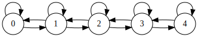

# Dénombrement et graphes

Auteur : Franck CHAMBON

## Contexte

!!! tip "Chemins d'un graphe"
    De nombreux problèmes peuvent être résolus en comptant le nombre de chemins dans un graphe.
    Un graphe possède une matrice de transition, et il suffit d'élever cette matrice à la puissance $k-1$ pour connaître le nombre de chemins de longueur $k$ d'un sommet à un autre.

### Exemple simple de problème résolu avec un graphe

!!! note "Nombre élégant"
    Un nombre est dit *élégant* quand l'écart entre deux chiffres consécutifs est d’au plus $1$. 
    
    Par exemple, $123323454$ est *élégant*, et $12354$ ne l’est pas.

!!! faq "Combien y a-t-il de nombres *élégants* de $8$ chiffres ?"
    
    - On se limitera ici aux nombres dont les chiffres sont de $0$ à $4$.
    - On acceptera les `0` de tête.


On utilise le graphe dont les sommets sont les chiffres de $0$ à $4$, et dont les arêtes sont dessinées ci-dessous :



Un nombre *élégant* de notre problème correspond à un chemin de longueur $7$ dans ce graphe, dont la matrice de transition est :

$$M = 
\begin{pmatrix}
1 & 1 & 0 & 0 & 0 \\
1 & 1 & 1 & 0 & 0 \\
0 & 1 & 1 & 1 & 0 \\
0 & 0 & 1 & 1 & 1 \\
0 & 0 & 0 & 1 & 1 \\
\end{pmatrix}
$$

$M^7$ indique le nombre de chemins de longueur $7$ entre tout couple de sommets.

$$M^7 = 
\begin{pmatrix}
127 & 196 & 189 & 132 &  63 \\
196 & 316 & 328 & 252 & 132 \\
189 & 328 & 379 & 328 & 189 \\
132 & 252 & 328 & 316 & 196 \\
 63 & 132 & 189 & 196 & 127 \\
\end{pmatrix}
$$

La somme des coefficients nous donne le nombre total de chemins de longueur $7$.


!!! tip "Astuce"
    Avec une calculatrice lycée (comme la NumWorks), il suffit d'entrer :

$$
\begin{pmatrix}
1 & 1 & 1 & 1 & 1 \\
\end{pmatrix}
\times
\begin{pmatrix}
1 & 1 & 0 & 0 & 0 \\
1 & 1 & 1 & 0 & 0 \\
0 & 1 & 1 & 1 & 0 \\
0 & 0 & 1 & 1 & 1 \\
0 & 0 & 0 & 1 & 1 \\
\end{pmatrix}^7
\times
\begin{pmatrix}
1 \\
1 \\
1 \\
1 \\
1 \\
\end{pmatrix}
$$

??? done "Réponse"
    Il y a $5275$ nombres élégants à $8$ chiffres (compris entre $0$ et $4$).

!!! example "Remarques"
    1. On aurait pu tout aussi facilement ne pas se restreindre aux chiffres de `0` à `4` ; la matrice aurait eu une taille $10×10$.
    2. Pour exclure les nombres avec zéro de tête, il suffit d'enlever les nombres élégants à $7$ chiffres (eux aussi avec zéros de tête acceptés).

### Problème avec un grand graphe

Pour une matrice de grande taille $n$, il n'est pas raisonnable d'utiliser la multiplication matricielle, le coût est en $\Theta(n^3)$.

On peut aussi travailler avec des [listes d'adjacence](https://fr.wikipedia.org/wiki/Liste_d%27adjacence), dans le cas d'un graphe peu connecté. La matrice est alors creuse (possède de nombreux zéros), et on peut calculer des nombres de **chemins courts** avec de simples itérations, sans utiliser la multiplication matricielle coûteuse...

Prenons, par exemple, le problème suivant issu de [Project Euler](https://projecteuler.net/problem=215 "problème n°215").

!!! tip "Project Euler 215"
    On souhaite construire un mur avec des briques de taille $2×1$ et $3×1$ posées horizontalement tel que, pour plus de solidité, les jointures verticales entre briques ne se suivent pas sur deux rangées successives, *i.e.* ne forment pas de fissure.

    Par exemple, le mur $9×3$ suivant n'est pas valide ; en cause, la fissure marquée en jaune :

    

    Il y a huit façons de construire un mur 9×3 sans fissure, que l'on note $W(9, 3) = 8$.
    
    **Problème :** Déterminer $W(32, 10)$.

!!! exemple "Au programme"

- Modéliser ce problème avec un graphe ;
- le résoudre avec une première méthode ;
- proposer plusieurs améliorations ;
- proposer du code en Python.


## Traduction en problème de graphe

Une rangée de briques est ici modélisée par une suite de nombres parmi $2$ et $3$ dont la somme est égale à la largeur du mur.

Dans le mur précédent, les rangées sont notées :

- $[3, 2, 2, 2]$ ;
- $[2, 2, 3, 2]$ ;
- $[3, 3, 3]$ ;
- chacune de somme $9$.

On définit le graphe dont :

- les sommets sont toutes les rangées possibles,
- les arêtes joignent deux rangées qui ne forment pas de fissure.

Construire un mur sans fissure de hauteur $h$ revient à effectuer un parcours de longueur $h$ dans ce graphe.

!!! tip "Compter le nombre total de murs sans fissure"
    Cela revient à compter le nombre total de chemins de longueur $h$, dans ce graphe.

### Génération des sommets

L'occasion ici de présenter les itérateurs du langage Python (hors programme NSI). On en construit ici un de manière récursive.

Construire une rangée de largeur $n$ :

- c'est construire une rangée de largeur $n-2$ et y ajouter une brique de largeur $2$ ; ou bien
- c'est construire une rangée de largeur $n-3$ et y ajouter une brique de largeur $3$.

{{ py('gen_rangs1') }}

Sortie :
```
[3, 2, 2, 2]
[2, 3, 2, 2]
[2, 2, 3, 2]
[2, 2, 2, 3]
[3, 3, 3]
```

!!! exemple "Remarques"
    - On constate qu'il existe $5$ rangées possibles de largeur $9$.
    - On ne voit pas directement, avec cette modélisation, si deux rangées provoquent une fissure.

### Génération des arêtes

Deux rangées provoquent-elles une fissure ?

Une solution simple consiste à calculer la suite des sommes partielles (pour deux rangées) et vérifier que seul le total est en commun.

{{ py('gen_aretes1')}}

Sortie :
```
Pour un mur de largeur 9 :
La rangée (3, 2, 2, 2) 	 est reliée aux rangées [(2, 2, 2, 3)]
La rangée (2, 3, 2, 2) 	 est reliée aux rangées [(3, 3, 3)]
La rangée (2, 2, 3, 2) 	 est reliée aux rangées [(3, 3, 3)]
La rangée (2, 2, 2, 3) 	 est reliée aux rangées [(3, 2, 2, 2)]
La rangée (3, 3, 3) 	 est reliée aux rangées [(2, 3, 2, 2), (2, 2, 3, 2)]
```


On constate sur cet exemple que :

- 4 sommets ne possèdent qu'une arrête en partance ;
- 1 sommet possède deux arrêtes en partance.

Le graphe semble ici peu connecté. À étudier quand la largeur du mur croît.

#### Calcul du nombre de sommets

(Ce paragraphe pourra être ignoré en première lecture)

Le nombre $u_n$ de rangées de longueur $n$ est donné par la récurrence :

- $u_0 = 1$; $u_1 = 0$; $u_2 =1$;
- $u_{n} + u_{n+1} = u_{n+3}$, pour $n\in \mathbb N$.

La solution réelle approchée de l'équation $1+x = x^3$ est $\rho\approx 1.32471795724475$, ce qui nous indique que $u_n \approx K \times \rho^n$ pour une certaine constante. Chose que l'on peut vérifier.

{{ py('exp_nb_sommets' )}}

Sortie :
```bash
Il y a 3329 sommets dans le graphe pour un mur de largeur 32.
0.999999999999997 , proche de 1 ?
K ≈ 0.41149558866263575
```


#### Calcul approché du nombre d'arêtes

(Ce paragraphe pourra être ignoré en première lecture)

Nous ferons le calcul exact dans une autre partie quand nous générerons dynamiquement le graphe.


{{ py('exp_nb_aretes') }}

Sortie (après moins d'une minute de calcul) :
```bash
Nombre de rangées : 3329
Nombre moyen de rangées compatibles : 11.150495644337639
```

- On constate, qu'en effet, on a affaire à une matrice de transition assez grande et creuse. Il ne faudra pas songer à la multiplier avec des méthodes classiques.

- On constate que notre approche naïve pour déterminer si deux rangées sont compatibles est très lente (plusieurs secondes ici), il faut songer à l'améliorer.


## Une première modélisation efficace

Pour représenter une rangée, on va utiliser un seul entier et sa représentation binaire. Par exemple notre mur fissuré d'introduction sera représenté par les rangées :

- `100101010` : pour $[3, 2, 2, 2]$ ;
- `101010010` : pour $[2, 2, 3, 2]$ ;
- `100100100` : pour $[3, 3, 3]$ ;

!!! info "Test rapide"
    Le grand bord vertical à droite n'est pas représenté avec cette modélisation. On peut tester avec un simple **et logique bit à bit** si deux rangées sont compatibles ou non ; le résultat devra être `100000000` en binaire pour deux rangées compatibles. De plus, le gain de place est conséquent, ce qui accélère les calculs.

{{ py('gen_rangs2') }}

Sortie :
```bash
0b100101010
0b101001010
0b101010010
0b101010100
0b100100100
```

On retrouve nos 5 rangées, et on constate visuellement très vite (en binaire) qu'il n'y en pas deux successives sans fissure (dans cet ordre là).

### Génération des arêtes

Pour déterminer si deux rangées $r_1$ et $r_2$ (de largeur $n$) sont sans fissure, il suffira de faire un **et logique bit à bit** : `r1 & r2 == 1 << (n-1)`

{{ py('gen_aretes2') }}

Sortie :
```bash
298 reliée à [340]
330 reliée à [292]
338 reliée à [292]
340 reliée à [298]
292 reliée à [330, 338]
```

!!! exemple "Remarques"
    1. Il sera plus commode de renuméroter nos sommets du graphe (les rangées du mur) par des nombres entiers consécutifs à partir de $0$.
    2. On utilise encore un dictionnaire pour cela, un outil très utile !

{{ py('gen_aretes3') }}

Sortie :
```bash
0 reliée à [3]
1 reliée à [4]
2 reliée à [4]
3 reliée à [0]
4 reliée à [1, 2]
```

Cette méthode est un peu lente pour construire le graphe, mais permet ensuite un calcul rapide du nombre de chemins cherché.

### Utilisation de la matrice creuse

Si on cherche le nombre de murs de hauteur $h$, il suffit de calculer la somme des coefficients de la matrice $M^{h-1}$. Nous l'avions vu en exemple introductif.

- On calcule $V' = M^{h-1}\times V$, où $V$ est un vecteur colonne rempli de $1$.
- La solution au problème est la somme des composantes de $V'$.
- Pour calculer $V'$, on procède avec une boucle :
    - **Initialisation** : $V$, un vecteur colonne rempli de $1$.
    - **Répéter $h-1$ fois** : $V \leftarrow M\times V$

{{ py('complet1') }}

Sortie :
```bash
W(9, 3) = 8
```

!!! done "Réussite"
  - On retrouve l'information initiale de l'énoncé : $W(9, 3) = 8$.
  - Nous avons là un programme capable de répondre au problème initial en quelques secondes, mais il n'est pas optimal.

À suivre...
