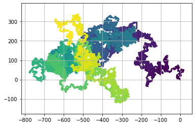
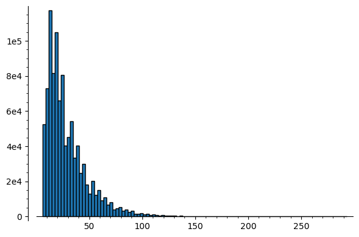
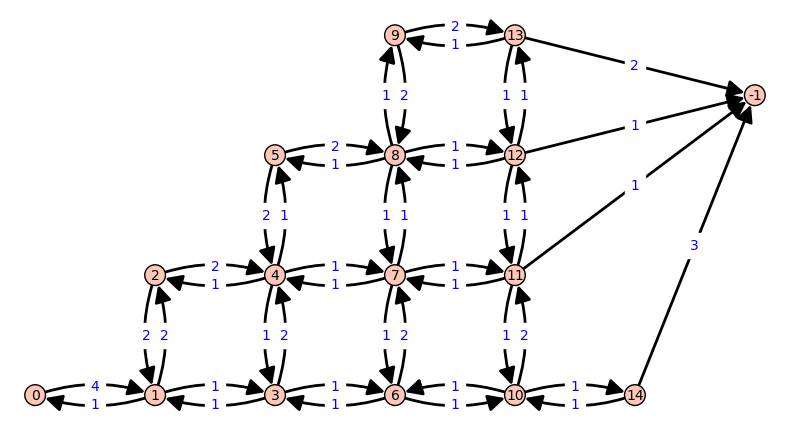

# Marche aléatoire isotrope sur $\mathbb Z ^2$

!!! warning "Kernel SageMath"
    Ce carnet Jupyter nécessite un noyau SageMath.

!!! danger inline "Le problème"
    Sur une grille, on part de $(0 ; 0)$, et on se déplace d'un pas vers
    
    - le haut,
    - le bas,
    - la gauche ou
    - la droite
    
    de manière équiprobable.

!!! example "Exemples de trois de marches aléatoires"
    {align=right}

    Sur la figure, trois marches aléatoires, avec $10\,000$ pas.

!!! faq "Question"
    Quel est le nombre de coup attendu pour sortir la première fois du disque de centre $O$ et de rayon $5$ ?

!!! abstract "Au programme"
    Le contenu, dans une première partie, est accessible aux lycéens, la suite relève du supérieur.

    - On commence par trouver une valeur approchée, en faisant une simulation.
    - ...
    - On détermine la valeur exacte. (Plus dur !)

## Une construction graphique

Avec une petite astuce pour mettre une couleur plus claire pour les points récents.

```python
%matplotlib inline

import matplotlib.pyplot as plt

X, Y = [], []
x, y = 0, 0
for _ in range(500_000):
    X.append(x)
    Y.append(y)
    dé = randint(1, 4)
    if dé == 1: x+=1
    if dé == 2: x-=1
    if dé == 3: y+=1
    if dé == 4: y-=1
plt.grid()
plt.scatter(X, Y, c= range(len(X)), marker = '.', s=1)
plt.axis('equal')
plt.show()
```



## Première étape : une simulation

On va générer $1\,000\,000$ marches aléatoires, que l'on stoppera quand on sort du disque, ce qui nous donnera une idée statistique.

- Rapide et facile à écrire.
- Mathématiques faciles.
- Long en temps de calcul, pour le million de marches.
- Précision très modeste du résultat.

```python
résultats = [] # une liste vide
for _ in range(1_000_000):
    x, y, n = 0, 0, 0.0
    while x*x + y*y <= 25:
        dé = randint(1, 4)
        if dé == 1: x += 1
        if dé == 2: x -= 1
        if dé == 3: y += 1
        if dé == 4: y -= 1
        n += 1
    résultats.append(n) # On ajoute n à notre liste

print(f"La moyenne est {mean(résultats)}, et l'écart-type {std(résultats)}")
histogram(résultats, bins=100)
```

    La moyenne est 29.2064280000000, et l'écart-type 20.2692130168358



On a trouvé une espérance proche de $29.2$, et un écart-type proche de $20.3$, avec une précision de l'ordre du dixième... Peut-on faire mieux ? Oui, certes pas avec des méthodes du lycée, mais le potentiel d'utilisation de SageMath est très intéressant pour l'enseignant.

## Deuxième étape : calcul approché de l'espérance et de l'écart-type

On va calculer précisément la probabilité $p_n(i,j)$ de se trouver à un point donné $(i,j)$ au bout de $n$ pas.

On note $q_n$ la probabilité de sortir au pas $n$. Une fois sorti du disque, on reste sorti ! On s'intéresse à la variable aléatoire : nombre de pas pour une première sortie !

```python
P = [[0]*11 for _ in range(11)]
P[0+5][0+5] = 1
Q = [0]
N = 1000
for n in range(1, N+1):
    PP = [[0]*11 for _ in range(11)] # Ce seront les valeurs à l'étape suivante
    q = 0
    for i in range(11):
        for j in range(11):
            for di,dj in [(0,1), (0,-1), (-1,0), (1,0)]:
                I, J = i+di, j+dj
                if (I-5)**2 + (J-5)**2 > 25:
                    q += P[i][j]/4
                else:
                    PP[I][J] += P[i][j]/4
    Q.append(q)
    P = PP

    if n%50 == 0:
        print(f"Avec {n} pas, on peut estimer l'espérance à", sum(k*Q[k] for k in range(n))*1.0 )
```

    Avec 50 pas, on peut estimer l'espérance à 19.7171783302963
    Avec 100 pas, on peut estimer l'espérance à 27.8969450065085
    Avec 150 pas, on peut estimer l'espérance à 29.0740085163112
    Avec 200 pas, on peut estimer l'espérance à 29.2112276193994
    Avec 250 pas, on peut estimer l'espérance à 29.2257508880369
    Avec 300 pas, on peut estimer l'espérance à 29.2272047033961
    Avec 350 pas, on peut estimer l'espérance à 29.2273450432855
    Avec 400 pas, on peut estimer l'espérance à 29.2273582487236
    Avec 450 pas, on peut estimer l'espérance à 29.2273594679547
    Avec 500 pas, on peut estimer l'espérance à 29.2273595788878
    Avec 550 pas, on peut estimer l'espérance à 29.2273595888643
    Avec 600 pas, on peut estimer l'espérance à 29.2273595897531
    Avec 650 pas, on peut estimer l'espérance à 29.2273595898316
    Avec 700 pas, on peut estimer l'espérance à 29.2273595898385
    Avec 750 pas, on peut estimer l'espérance à 29.2273595898391
    Avec 800 pas, on peut estimer l'espérance à 29.2273595898392
    Avec 850 pas, on peut estimer l'espérance à 29.2273595898392
    Avec 900 pas, on peut estimer l'espérance à 29.2273595898392
    Avec 950 pas, on peut estimer l'espérance à 29.2273595898392
    Avec 1000 pas, on peut estimer l'espérance à 29.2273595898392

Il semble que nous ayons une convergence vers la valeur approchée 29.2273595898392 pour l'espérance.

```python
variance = sum(k*k*Q[k] for k in range(N)) - 29.2273595898392**2
print("La variance est alors", variance)
print("L'écart-type est alors", variance**0.5)
```

    La variance est alors 411.534996811382
    L'écart-type est alors 20.2863253649196

On obtient ainsi aussi une valeur plus précise de l'écart-type.

## Troisième étape : valeur exacte, approximation rationnelle

Espérance : 29.2273595898392 = ?

Trouvons la _meilleure_ écriture fractionnaire !

```python
x = 29.2273595898392
a, b = 29, 1 # correspond à la fraction a/b = 29
c, d = 30, 1 # correspond à la fraction c/d = 30
while c/d - a/b > 10**-18:
    p,q = a+c, b+d  # ruse de sioux !!!!!!!!!!!!!!!!
    if abs(p/q - x) < 10**-13:
        print(p, q, abs(p/q - x), "BINGO")
        break
    if p/q < x:
        a,b = p,q
        print(a, b, p/q-x)
    else:
        c,d = p,q
        print(c,d, p/q-x)
```

    59 2 0.272640410160800
    88 3 0.105973743494133
    117 4 0.0226404101608004
    146 5 -0.0273595898392003
    263 9 -0.00513736761697814
    380 13 0.00340964093003038
    643 22 -0.0000868625664729450
    1023 35 0.00121183873222819
    1666 57 0.000710585599396296
    2309 79 0.000488511426624427
    2952 101 0.000363182438029241
    3595 123 0.000282686583563674
    4238 145 0.000226617057350609
    4881 167 0.000185320340442274
    5524 189 0.000153637674028317
    6167 211 0.000128561819568773
    6810 233 0.000108221319599977
    7453 255 0.0000913905529564829
    8096 277 0.0000772332654932484
    8739 299 0.0000651593246807636
    9382 321 0.0000547403788679901
    10025 343 0.0000456579742120766
    10668 365 0.0000376704347715417
    11311 387 0.0000305910393549880
    11954 409 0.0000242732414861280
    12597 431 0.0000186004160198650
    13240 453 0.0000134785934697845
    13883 475 8.83121343164817e-6
    14526 497 4.59527146290384e-6
    15169 519 7.18445964054126e-7
    15812 541 -2.84307395048700e-6
    30981 1060 -1.09927316316316e-6
    46150 1579 -5.01808798958336e-7
    61319 2098 -1.99944061307633e-7
    76488 2617 -1.78101586811863e-8
    91657 3136 1.04038353043734e-7
    168145 5753 4.86103033381369e-8
    244633 8370 2.78429972411232e-8
    321121 10987 1.69688476603369e-8
    397609 13604 1.02784127875566e-8
    474097 16221 5.74677017084468e-9
    550585 18838 2.47420928189968e-9
    627073 21455 0.000000000000000 BINGO

!!! done "Conclusion ?"
    Il semble que $\dfrac{627073}{21455}$ soit une excellente approximation rationnelle de l'espérance.

    Est-ce la valeur exacte ? Nous allons voir que oui et que c'était prévisible d'avoir une valeur rationnelle !

## Quatrième étape : étude du graphe

Il y a quatre axes de symétrie sur le tableau des probabilités, utilisons-les pour limiter le nombre de sommets au graphe qui modélise la situation.

On notera alors, $a$, $b$, $\cdots$ les différentes zones de même probabilité.

On note $x$ la zone hors du disque de rayon 5.

```python
import sage.graphs.graph_plot
sage.graphs.graph_plot.DEFAULT_SHOW_OPTIONS['figsize'] = [8,8]
T = [[-1]*13 for _ in range(13)]
points = "abcdefghijklmnopqrstx"
k = 0
D = DiGraph(multiedges=True, sparse=True,loops=True)
Pos = dict() # dictionnaire des positions
sc = 5 # échelle
Pos[-1] = [sc*6, sc*2.5]
for i in range(6):
    for j in range(i+1):
        if i*i+j*j<=25:
            T[i+6][j+6]=k
            Pos[k] = [sc*i,sc*j]
            k+=1
for i in range(-6, 7):
    for j in range(-6, 7):
        if i*i+j*j<=25:
            I, J = abs(i), abs(j)
            I,J = max(I,J), min(I,J)
            T[i+6][j+6] = T[I+6][J+6]
            #print(i,j, I,J)
for t in T: print(" ".join(points[ti] for ti in t))
for i in range(6):
    for j in range(i+1):
        if i*i+j*j<=25:
            autour = dict()
            for di,dj in [(0,1), (1,0), (0,-1), (-1,0)]:
                if T[i+6+di][j+6+dj] not in autour:
                    autour[T[i+6+di][j+6+dj]] = 1
                else:
                    autour[T[i+6+di][j+6+dj]] += 1
            for k in autour:
                D.add_edge(T[i+6][j+6], k, autour[k])

D.graphplot(pos=Pos, vertex_size=12000, vertex_labels= True, edge_labels=True, dist=1, edge_thickness=1, loop_size=2).show()
```

    x x x x x x x x x x x x x
    x x x x x x o x x x x x x
    x x x n m l k l m n x x x
    x x n j i h g h i j n x x
    x x m i f e d e f i m x x
    x x l h e c b c e h l x x
    x o k g d b a b d g k o x
    x x l h e c b c e h l x x
    x x m i f e d e f i m x x
    x x n j i h g h i j n x x
    x x x n m l k l m n x x x
    x x x x x x o x x x x x x
    x x x x x x x x x x x x x



Dans ce graphe, $0$ correspond à la zone $a$, $1$ à $b$, $2$ à $c$, etc, et $-1$ à $x$.

Les poids correspondent à la matrice de transition, où $\dfrac 1 4$ a été mis en facteur. On note que de chaque sommet, un total de $4$ est sortant, sauf au départ de la zone $-1$.

Voici la matrice de transition.

```python
A = D.weighted_adjacency_matrix()/4; A
```

    [  0   0   0   0   0   0   0   0   0   0   0   0   0   0   0   0]
    [  0   0   1   0   0   0   0   0   0   0   0   0   0   0   0   0]
    [  0 1/4   0 1/2 1/4   0   0   0   0   0   0   0   0   0   0   0]
    [  0   0 1/2   0   0 1/2   0   0   0   0   0   0   0   0   0   0]
    [  0   0 1/4   0   0 1/2   0 1/4   0   0   0   0   0   0   0   0]
    [  0   0   0 1/4 1/4   0 1/4   0 1/4   0   0   0   0   0   0   0]
    [  0   0   0   0   0 1/2   0   0   0 1/2   0   0   0   0   0   0]
    [  0   0   0   0 1/4   0   0   0 1/2   0   0 1/4   0   0   0   0]
    [  0   0   0   0   0 1/4   0 1/4   0 1/4   0   0 1/4   0   0   0]
    [  0   0   0   0   0   0 1/4   0 1/4   0 1/4   0   0 1/4   0   0]
    [  0   0   0   0   0   0   0   0   0 1/2   0   0   0   0 1/2   0]
    [  0   0   0   0   0   0   0 1/4   0   0   0   0 1/2   0   0 1/4]
    [1/4   0   0   0   0   0   0   0 1/4   0   0 1/4   0 1/4   0   0]
    [1/4   0   0   0   0   0   0   0   0 1/4   0   0 1/4   0 1/4   0]
    [1/2   0   0   0   0   0   0   0   0   0 1/4   0   0 1/4   0   0]
    [3/4   0   0   0   0   0   0   0   0   0   0 1/4   0   0   0   0]


Un peu d'algèbre linéaire nous donne la réponse à notre problème.

!!! faq "Comment utiliser cette matrice ?"
    $A^n$ possède une cellule 2^e^ ligne, 1^e^ colonne qui donne la probabilité de sortir du disque pour la première fois au coup $n$, si on était parti du centre. (On multiplie à droite par le vecteur $(1, 0, 0, 0, \cdots)$ pour le résultat final : proba d'être en zone $x$.) (On multiplie à gauche par le vecteur $(0, 1, 0, 0, 0, \cdots)$ pour les conditions initiales : tout en zone $a$.)

    - `A**n[1][0]` est cette probabilité.

L'espérance du nombre de coups pour sortir (la première fois) du disque de rayon 5, en partant du centre est :


```python
(A*(1-A)**-2)[1][0]
```

    627073/21455

Voilà donc la preuve de la valeur exacte que nous avions conjecturé. Son caractère rationnel n'est plus étonnant.

```python
variance = (A*(1+A)*(1-A)**-3 )[1][0] - ((A*(1-A)**-2)[1][0])**2
print("La variance est", variance)
print("L'écart type est", sqrt(variance), "environ", (sqrt(variance*1.0)))
```

    La variance est 947182827078/2301585125
    L'écart type est 3/21455*sqrt(105242536342/5) environ 20.2863253649196

Cela confirme que la première simulation statistique donnait un écart-type avec une précision de deux dixièmes pour un échantillon d'un million de marches (méthode du pauvre). La seconde méthode nous a donné une valeur très précise mais toujours approchée.
