# Énumération

!!! tip "Quelques problèmes de dénombrement"
    { align=right width=600 }

    !!! info "Les énoncés sont simples"
        Leur résolution fait intervenir des méthodes variées en mathématiques et en algorithmique.

        Plusieurs méthodes sont proposées, progressivement, avec un code en Python et les bonnes pratiques mises en avant.

    !!! warning "Résolutions avancées"
        Les méthodes avancées nécessitent des connaissances en algèbre linéaire ou en arithmétique, et sont destinées au public d'enseignants de mathématiques, ou d'étudiants.

!!! abstract "Triangles dans une figure"
    { align=right width=200 }

    On cherche à compter le nombre de triangles dans une figure construite selon un certain motif. L'occasion de travailler avec des polynômes.

    [Triangles dans une figure](1.triangles/triangles.md){ .md-button }

    Quelques exercices sont proposés, dont certains interactifs.

!!! abstract "Pavages de rectangle"
    { align=right width=300 }

    On cherche à déterminer un terme lointain dans une suite récurrente linéaire, après en avoir établi la récurrence.

    [Pavages de rectangle](2.pavages/pavages.md){ .md-button }

    De nombreux exercices faciles à très difficiles sont proposés.

!!! abstract "Mur en brique sans fissure"
    { align=right width=300 }

    On calcule le nombre de chemins dans un **grand** graphe creux.

    [Mur en brique sans fissure](3.mur_brique/mur_brique.md){ .md-button }

    Plusieurs modélisations sont proposées, de la programmation dynamique est utilisée pour construire le graphe de manière efficace. On utilisera avec bon escient les dictionnaires.

!!! abstract "Quantité de nombres premiers"
    { align=right width=300 }

    On présente, et on discute, différents algorithmes de difficulté croissante :

    - des tests de primalité élémentaires ;
    - le crible d'Ératosthène ;
    - la méthode de Meissel-Lehmer, expliquée avec de la programmation dynamique

    [Quantité de nombres premiers](4.arith/arith.md){ .md-button }

    Deux problèmes sont donnés en exercice :
    
    - ils permettent de mettre en application les méthodes.
